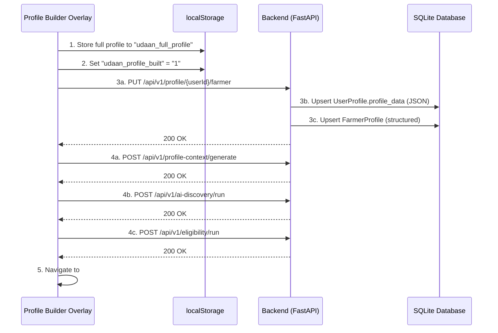
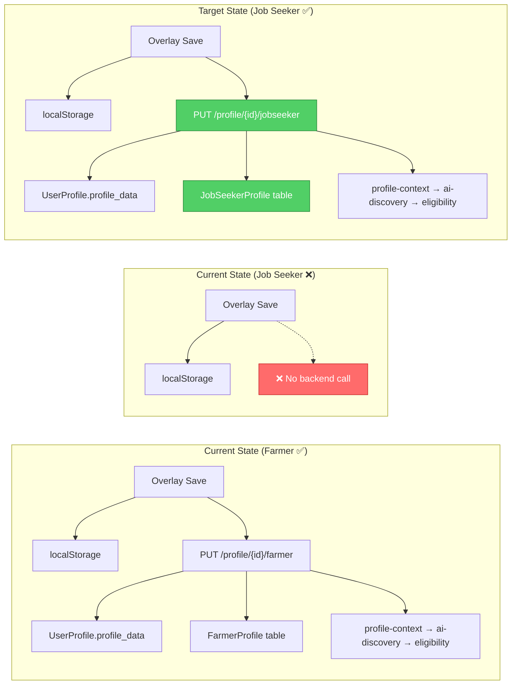

# Job Seeker Profile Persistence Plan

**Document Version**: 1.0  
**Phase**: Pre-Implementation Analysis  
**Status**: Analysis only — no code changes

---

## 1. How the Farmer Profile Save Flow Works

The farmer profile persistence is a **4-step chained flow** triggered when the user completes the Profile Builder overlay and clicks "Save". The chain is implemented in [c33aa38d-654c-4053-bad9-41e46538669f.js](file:///c:/Users/CHINNI/OneDrive/Desktop/Udaan/udan/scripts_decoded/c33aa38d-654c-4053-bad9-41e46538669f.js), lines 28–72.

### Flow Diagram



### Step-by-Step Breakdown

| Step | Action | Code Location |
|------|--------|---------------|
| 1 | `localStorage.setItem("udaan_full_profile", JSON.stringify(values))` | [saveValues L30](file:///c:/Users/CHINNI/OneDrive/Desktop/Udaan/udan/scripts_decoded/c33aa38d-654c-4053-bad9-41e46538669f.js#L30) |
| 2 | `localStorage.setItem("udaan_profile_built", "1")` | [saveValues L31](file:///c:/Users/CHINNI/OneDrive/Desktop/Udaan/udan/scripts_decoded/c33aa38d-654c-4053-bad9-41e46538669f.js#L31) |
| 3 | Check `role === "farmer" \|\| role === "farmers"` | [saveValues L36](file:///c:/Users/CHINNI/OneDrive/Desktop/Udaan/udan/scripts_decoded/c33aa38d-654c-4053-bad9-41e46538669f.js#L36) |
| 4 | Build payload from overlay values | [saveValues L37–52](file:///c:/Users/CHINNI/OneDrive/Desktop/Udaan/udan/scripts_decoded/c33aa38d-654c-4053-bad9-41e46538669f.js#L37-L52) |
| 5 | `PUT /api/v1/profile/{userId}/farmer` | [saveValues L54](file:///c:/Users/CHINNI/OneDrive/Desktop/Udaan/udan/scripts_decoded/c33aa38d-654c-4053-bad9-41e46538669f.js#L54) |
| 6 | Chain: profile-context → ai-discovery → eligibility | [saveValues L58–63](file:///c:/Users/CHINNI/OneDrive/Desktop/Udaan/udan/scripts_decoded/c33aa38d-654c-4053-bad9-41e46538669f.js#L58-L63) |
| 7 | Navigate to `#dashboard/farmers` | [saveValues L65](file:///c:/Users/CHINNI/OneDrive/Desktop/Udaan/udan/scripts_decoded/c33aa38d-654c-4053-bad9-41e46538669f.js#L65) |
| 8 | On error: still navigate (graceful degradation) | [saveValues L66–68](file:///c:/Users/CHINNI/OneDrive/Desktop/Udaan/udan/scripts_decoded/c33aa38d-654c-4053-bad9-41e46538669f.js#L66-L68) |

> [!IMPORTANT]
> Steps 1–2 (localStorage) execute for **ALL roles** including jobseekers.  
> Steps 3–8 (backend persistence) execute **ONLY for farmers** — there is no equivalent `if (role === "jobseeker")` branch.

---

## 2. Which Endpoint Farmers POST To

**Endpoint**: `PUT /api/v1/profile/{user_id}/farmer`

**Implementation**: [auth.py](file:///c:/Users/CHINNI/OneDrive/Desktop/Udaan/udan/app/api/routers/auth.py#L142-L170), lines 142–170

```python
@router.put("/profile/{user_id}/farmer", tags=["Profile"])
def update_farmer_profile(user_id: int, payload: dict, session: Session = Depends(get_session)):
```

> [!NOTE]
> This endpoint is defined in `auth.py` (not in `profile.py`). The `profile.py` router defines Pydantic schema models but uses a **generic** `PUT /profile/{user_id}/{role}` endpoint (line 130) that accepts `Dict[str, Any]` — it does NOT write to the database, only returns mock responses. The actual farmer persistence is in `auth.py`.

### Chained Endpoints (Post-Save Triggers)

| Order | Method | Endpoint | Purpose | Implementation |
|-------|--------|----------|---------|----------------|
| 1 | `POST` | `/api/v1/profile-context/generate` | Generate AI profile context | [auth.py L172–174](file:///c:/Users/CHINNI/OneDrive/Desktop/Udaan/udan/app/api/routers/auth.py#L172-L174) — stub |
| 2 | `POST` | `/api/v1/ai-discovery/run` | Run opportunity discovery | [auth.py L176–178](file:///c:/Users/CHINNI/OneDrive/Desktop/Udaan/udan/app/api/routers/auth.py#L176-L178) — stub |
| 3 | `POST` | `/api/v1/eligibility/run` | Compute eligibility | [auth.py L180–182](file:///c:/Users/CHINNI/OneDrive/Desktop/Udaan/udan/app/api/routers/auth.py#L180-L182) — stub |

---

## 3. What Request Schema Farmers Use

### Frontend Payload (JavaScript → JSON)

From [saveValues L37–52](file:///c:/Users/CHINNI/OneDrive/Desktop/Udaan/udan/scripts_decoded/c33aa38d-654c-4053-bad9-41e46538669f.js#L37-L52):

```json
{
  "state":              "string  — from overlay location.state",
  "district":           "string  — from overlay location.district",
  "category":           "string  — from overlay social.category",
  "annual_income":      "string  — from overlay social.annual_family_income",
  "owns_land":          "boolean — from overlay land.owns_land === 'Yes'",
  "land_area":          "float   — parseFloat(overlay land.land_area)",
  "land_unit":          "string  — from overlay land.land_unit",
  "crop_type":          "string  — from overlay farm.crop_type",
  "farmer_registration":"boolean — !!overlay farmer_status.farmer_registration",
  "pm_kisan_enrolled":  "boolean — !!overlay farmer_status.pm_kisan_enrolled",
  "crop_insurance":     "boolean — !!overlay farmer_status.crop_insurance",
  "smartphone":         "boolean — !!overlay digital.smartphone_available",
  "internet_access":    "boolean — !!overlay digital.internet_access",
  "documents":          "array   — overlay documents_available (string[])"
}
```

### Backend Acceptance

The backend endpoint accepts `payload: dict` (untyped dictionary). It does NOT validate against a Pydantic schema — it reads keys using `.get()` with defaults.

---

## 4. What Backend Models Farmers Populate

The farmer endpoint writes to **two** database tables:

### Table 1: `user_profiles` (via [UserProfile](file:///c:/Users/CHINNI/OneDrive/Desktop/Udaan/udan/app/models/domain.py#L33-L53) model)

```python
user_profile.profile_data = payload  # Stores entire overlay payload as JSON
```

| Column | Type | What Gets Stored |
|--------|------|-----------------|
| `profile_data` | `JSON` (dict) | The entire farmer payload — all 14 fields |

### Table 2: `farmer_profiles` (via [FarmerProfile](file:///c:/Users/CHINNI/OneDrive/Desktop/Udaan/udan/app/models/domain.py#L317-L329) model)

```python
class FarmerProfile(SQLModel, table=True):
    __tablename__ = "farmer_profiles"
    user_id:           int    # FK → users.id
    land_size_acres:   float  # ← payload.land_area
    land_type:         str    # ← "Irrigated" if payload.owns_land else "None"
    primary_crop:      str    # ← payload.crop_type
    pm_kisan_id:       str?   # ← "Yes" if payload.pm_kisan_enrolled else None
    has_kisan_credit_card: bool  # (not mapped from payload — stays default)
    annual_income:     float  # ← payload.annual_income
```

### Mapping: Frontend Overlay → Backend Column

| Overlay Key | Farmer Payload Key | `UserProfile.profile_data` | `FarmerProfile` Column |
|-------------|-------------------|:--------------------------:|:---------------------:|
| `state` | `state` | ✅ (in JSON) | — |
| `district` | `district` | ✅ (in JSON) | — |
| `category` | `category` | ✅ (in JSON) | — |
| `annual_family_income` | `annual_income` | ✅ (in JSON) | `annual_income` |
| `owns_land` | `owns_land` | ✅ (in JSON) | `land_type` (derived) |
| `land_area` | `land_area` | ✅ (in JSON) | `land_size_acres` |
| `land_unit` | `land_unit` | ✅ (in JSON) | — |
| `crop_type` | `crop_type` | ✅ (in JSON) | `primary_crop` |
| `farmer_registration` | `farmer_registration` | ✅ (in JSON) | — |
| `pm_kisan_enrolled` | `pm_kisan_enrolled` | ✅ (in JSON) | `pm_kisan_id` (derived) |
| `crop_insurance` | `crop_insurance` | ✅ (in JSON) | — |
| `smartphone_available` | `smartphone` | ✅ (in JSON) | — |
| `internet_access` | `internet_access` | ✅ (in JSON) | — |
| `documents_available` | `documents` | ✅ (in JSON) | — |

> **Key insight**: The farmer flow uses a **dual-write** strategy:
> 1. The full payload goes into `UserProfile.profile_data` as unstructured JSON (for flexibility)
> 2. Selected fields are extracted into `FarmerProfile` structured columns (for queries/eligibility)

---

## 5. What the Equivalent Job Seeker Endpoint Should Be

### Proposed Endpoint

```
PUT /api/v1/profile/{user_id}/jobseeker
```

### Location

Should be added to [auth.py](file:///c:/Users/CHINNI/OneDrive/Desktop/Udaan/udan/app/api/routers/auth.py) — directly after the farmer endpoint (after line 170) — to follow the same architectural pattern.

### Backend Logic (Parallel to Farmer)

```
1. Look up UserProfile by user_id
2. Store full payload in UserProfile.profile_data (JSON)
3. Extract structured fields into JobSeekerProfile model
4. Upsert JobSeekerProfile
5. Commit
6. Return success
```

> [!NOTE]
> The `profile.py` router already defines a generic `PUT /profile/{user_id}/{role}` endpoint (line 130) that handles `role == "jobseeker"`, but it **does NOT write to the database** — it only returns mock responses. The new dedicated endpoint should follow the farmer pattern in `auth.py` which does actual DB writes.

### Existing Database Table

The [JobSeekerProfile](file:///c:/Users/CHINNI/OneDrive/Desktop/Udaan/udan/app/models/domain.py#L331-L343) model **already exists** in `domain.py`:

```python
class JobSeekerProfile(SQLModel, table=True):
    __tablename__ = "jobseeker_profiles"
    id:                   int          # PK
    user_id:              int          # FK → users.id (unique)
    education_level:      str          # ← qualification
    skills:               List[str]    # ← JSON column
    employment_status:    str          # ← NEW (not in overlay yet)
    years_of_experience:  float        # ← experience_years
    preferred_job_role:   str          # ← NEW (not in overlay yet)
    is_disabled:          bool         # ← derive from special_category
    created_at:           datetime
```

> [!IMPORTANT]
> The `jobseeker_profiles` table and `JobSeekerProfile` SQLModel already exist and are already imported in `domain.py`. The database table is created via SQLModel metadata. **No new model or migration is needed** — only the endpoint and frontend `saveValues` branch.

---

## 6. What Request Schema Job Seekers Should Send

### Proposed Frontend Payload (JavaScript → JSON)

Following the farmer pattern — map overlay field keys to backend-consumable payload keys:

```json
{
  "state":              "string  — from overlay location.state",
  "district":           "string  — from overlay location.district",
  "category":           "string  — from overlay social.category",
  "annual_family_income": "string  — from overlay social.annual_family_income",
  "special_category":   "string  — from overlay social.special_category",
  "qualification":      "string  — from overlay js_education.qualification",
  "experience_years":   "string  — from overlay js_education.experience_years",
  "preferred_job_role": "string  — from overlay js_education.preferred_job_role (NEW)",
  "employment_status":  "string  — from overlay js_education.employment_status (NEW)",
  "skills":             "array   — from overlay js_skills (NEW multi-select)",
  "is_disabled":        "boolean — derived: special_category === 'PwD'",
  "smartphone":         "boolean — from overlay digital.smartphone_available",
  "internet_access":    "boolean — from overlay digital.internet_access",
  "documents":          "array   — from overlay documents_available (string[])"
}
```

### Backend Column Mapping

| Payload Key | `UserProfile.profile_data` | `JobSeekerProfile` Column | Transform |
|-------------|:--------------------------:|:------------------------:|-----------|
| `state` | ✅ (in JSON) | — | Direct |
| `district` | ✅ (in JSON) | — | Direct |
| `category` | ✅ (in JSON) | — | Direct |
| `annual_family_income` | ✅ (in JSON) | — | Direct |
| `special_category` | ✅ (in JSON) | — | Direct |
| `qualification` | ✅ (in JSON) | `education_level` | Direct |
| `experience_years` | ✅ (in JSON) | `years_of_experience` | `parseFloat()` |
| `preferred_job_role` | ✅ (in JSON) | `preferred_job_role` | Direct |
| `employment_status` | ✅ (in JSON) | `employment_status` | Direct |
| `skills` | ✅ (in JSON) | `skills` | Direct (JSON array) |
| `is_disabled` | ✅ (in JSON) | `is_disabled` | `special_category === "PwD"` |
| `smartphone` | ✅ (in JSON) | — | Direct |
| `internet_access` | ✅ (in JSON) | — | Direct |
| `documents` | ✅ (in JSON) | — | Direct |

---

## 7. Which Fields from the Existing Job Seeker Overlay Can Already Be Persisted

### Currently Available in Overlay Schema

From [UDAAN_PROFILE_SCHEMA](file:///c:/Users/CHINNI/OneDrive/Desktop/Udaan/udan/scripts_decoded/4f088cda-a00e-40fa-90c8-2eb2398d268b.js) — the jobseeker persona has **common sections + 1 persona section**:

| Section | Schema ID | Fields Available | Persistable to Backend? |
|---------|-----------|-----------------|:----------------------:|
| Basic Information | `identity` | `full_name`, `mobile_number`, `email`, `date_of_birth`, `gender` | ✅ Already in `UserProfile` |
| Location | `location` | `state`, `district`, `village_city`, `urban_or_rural` | ✅ Via `profile_data` JSON |
| Social | `social` | `category`, `annual_family_income`, `family_size`, `special_category` | ✅ Via `profile_data` JSON |
| Documents | `documents_available` | multi-select (7 options) | ✅ Via `profile_data` JSON |
| Digital | `digital` | `smartphone_available`, `internet_access`, `digital_payment_access` | ✅ Via `profile_data` JSON |
| Education (JS) | `js_education` | `qualification`, `experience_years` | ✅ Maps to `education_level`, `years_of_experience` |

### Summary: 2 of 6 `JobSeekerProfile` Columns Can Be Populated Today

| `JobSeekerProfile` Column | Overlay Source | Available Now? |
|--------------------------|----------------|:--------------:|
| `education_level` | `qualification` | ✅ Yes |
| `years_of_experience` | `experience_years` | ✅ Yes |
| `skills` | — | ❌ **Missing** |
| `employment_status` | — | ❌ **Missing** |
| `preferred_job_role` | — | ❌ **Missing** |
| `is_disabled` | Derivable from `special_category === "PwD"` | ⚠️ Partial — no dedicated field |

---

## 8. Additional Overlay Fields Required

### 8A. Skills (Multi-Select Section)

**Why**: The `JobSeekerProfile.skills` column expects a `List[str]`. The dashboard's `profile.skills` is hardcoded as `["Python", "SQL", "HTML", "CSS"]`. The eligibility decoder matches skills against opportunity requirements. Without a skills section, skill-based matching is impossible.

**Current state**: No `js_skills` section exists in the jobseeker persona schema.

**Proposed schema addition**:

```js
// Add to personas.jobseekers[] in 4f088cda-a00e-40fa-90c8-2eb2398d268b.js
{
  id: "js_skills",
  title: "Skills",
  icon: "spark",
  type: "multi",
  hint: "Select your current skills. Used to match you with skilling schemes.",
  options: [
    "Python", "SQL", "JavaScript", "Java", "HTML/CSS", "C/C++",
    "Data Analysis", "MS Office", "Tally / Accounting",
    "Communication (English)", "Leadership", "Customer Service",
    "Electrical Wiring", "Plumbing", "Welding / Fabrication",
    "Tailoring / Textile", "Mobile Repair", "Computer Hardware"
  ]
}
```

**Payload mapping**: `payload.skills = values.js_skills || []`

**Backend column**: `JobSeekerProfile.skills` (JSON array — already defined)

---

### 8B. Preferred Job Role (Text Field)

**Why**: The `JobSeekerProfile.preferred_job_role` column expects a `str`. The dashboard hardcodes `"Junior Software Engineer"`. The alert center and voice chat use it for personalized recommendations.

**Current state**: Not in overlay. No field exists.

**Proposed schema addition** (extend existing `js_education` section):

```js
// Add to personas.jobseekers[0].fields (js_education section)
{ key: "preferred_job_role", label: "Preferred Job Role", type: "text" }
```

**Payload mapping**: `payload.preferred_job_role = values.preferred_job_role || ""`

**Backend column**: `JobSeekerProfile.preferred_job_role` (str — already defined)

---

### 8C. Employment Status (Select Field)

**Why**: The `JobSeekerProfile.employment_status` column expects a `str`. It determines eligibility for schemes: PMKVY requires "Unemployed" or "Student", NATS requires "Fresher".

**Current state**: Not in overlay. No field exists.

**Proposed schema addition** (extend existing `js_education` section):

```js
// Add to personas.jobseekers[0].fields (js_education section)
{
  key: "employment_status",
  label: "Employment Status",
  type: "select",
  options: ["Fresher", "Employed", "Self-Employed", "Unemployed", "Student"]
}
```

**Payload mapping**: `payload.employment_status = values.employment_status || "Fresher"`

**Backend column**: `JobSeekerProfile.employment_status` (str — already defined)

---

### 8D. Additional Document Options

**Why**: The dashboard's Document Readiness Panel checks for `Graduation Certificate`, `Intermediate (12th) Certificate`, etc. The current `documents_available` multi-select has only 7 options, none of which are education certificates.

**Current `documents_available` options** (line 27 of schema):
```
Aadhaar, PAN, Income Certificate, Caste Certificate, Ration Card, Bank Account, Land Passbook
```

**Proposed additions** to the common `documents_available.options` array:

| New Option | Dashboard Usage |
|-----------|-----------------|
| `Graduation Certificate` | SSC CGL eligibility, document panel "Verified" status |
| `Intermediate (12th) Certificate` | RRB NTPC eligibility |
| `10th Class Certificate` | Basic qualification verification |
| `Experience Letter` | Experience verification for employed seekers |

**Proposed updated options array**:
```js
options: [
  "Aadhaar", "PAN", "Income Certificate", "Caste Certificate",
  "Ration Card", "Bank Account", "Land Passbook",
  "Graduation Certificate", "Intermediate (12th) Certificate",
  "10th Class Certificate", "Experience Letter"
]
```

> [!WARNING]
> Adding options to the common `documents_available` section will make these options visible to **all personas** (students, farmers, etc.). This is acceptable since education certificates and experience letters are universally applicable. However, "Land Passbook" (farmer-specific) is already in the common section, establishing this precedent.

---

## Summary: Changes Required Across Files

### Files Requiring Modification (4 total)

| # | File | Change | Scope |
|---|------|--------|-------|
| 1 | [4f088cda-...js](file:///c:/Users/CHINNI/OneDrive/Desktop/Udaan/udan/scripts_decoded/4f088cda-a00e-40fa-90c8-2eb2398d268b.js) (Schema) | Add `preferred_job_role`, `employment_status` to `js_education`; Add new `js_skills` section; Add 4 document options | Frontend schema |
| 2 | [c33aa38d-...js](file:///c:/Users/CHINNI/OneDrive/Desktop/Udaan/udan/scripts_decoded/c33aa38d-654c-4053-bad9-41e46538669f.js) (SaveValues) | Add `if (role === "jobseeker" \|\| role === "jobseekers")` branch parallel to farmer | Frontend persistence |
| 3 | [auth.py](file:///c:/Users/CHINNI/OneDrive/Desktop/Udaan/udan/app/api/routers/auth.py) | Add `PUT /profile/{user_id}/jobseeker` endpoint after L170 | Backend endpoint |
| 4 | [auth.py](file:///c:/Users/CHINNI/OneDrive/Desktop/Udaan/udan/app/api/routers/auth.py) L7 | Add `JobSeekerProfile` to the import from `app.models.domain` | Backend import |

### Files NOT Requiring Modification

| File | Reason |
|------|--------|
| [domain.py](file:///c:/Users/CHINNI/OneDrive/Desktop/Udaan/udan/app/models/domain.py) | `JobSeekerProfile` model already exists (L331–343) with all needed columns |
| [profile.py](file:///c:/Users/CHINNI/OneDrive/Desktop/Udaan/udan/app/api/routers/profile.py) | Generic `PUT /profile/{user_id}/{role}` can remain as a mock fallback |
| Database migrations | SQLModel auto-creates tables; `jobseeker_profiles` already defined |

---

## Implementation Order (When Approved)

| Step | What | Depends On |
|------|------|-----------|
| 1 | Add 3 fields + 1 section to overlay schema (`4f088cda-...js`) | Nothing |
| 2 | Add 4 document options to common schema (`4f088cda-...js`) | Nothing |
| 3 | Add jobseeker `saveValues` branch (`c33aa38d-...js`) | Step 1 |
| 4 | Add `PUT /profile/{user_id}/jobseeker` endpoint (`auth.py`) | Nothing |
| 5 | Add `JobSeekerProfile` import to `auth.py` | Nothing |
| 6 | Run `update_bundle.py` to repack standalone HTML | Steps 1–3 |
| 7 | Test: Register jobseeker → fill overlay → verify DB write | Steps 4–6 |

> [!CAUTION]
> After modifying `scripts_decoded/*.js` files, the standalone HTML bundle must be regenerated using `update_bundle.py`. Without repacking, the browser will load the old cached bundle and no overlay changes will take effect.

---

## Current vs. Target State Comparison



---

**Document generated. No code has been modified. Awaiting confirmation to proceed with implementation.**
